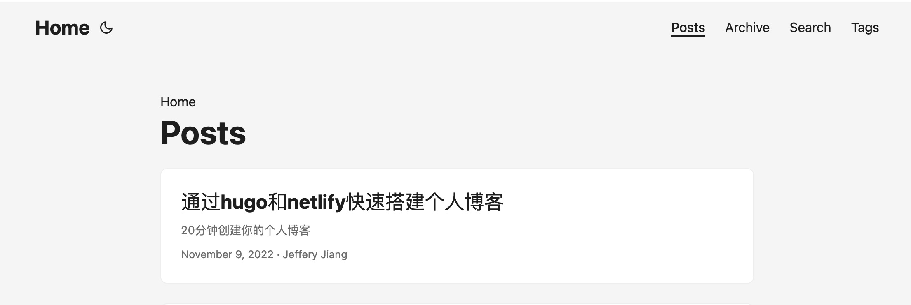

## 前言

作为一个前端开发，之前使用过像`vuepress` 之类的doc generator，但是感觉此类工具存在一些弊端，比如社区不够活跃，开发门槛较高，layout太单一等等。

[Hugo](https://gohugo.io/)作为现在最火热的文档生成器，在github有超过6w标星。他的优点有：

- 更快的构建速度
- 清晰，详细的文档，一目明了的项目结构，开箱即用，使用门槛低
- 丰富多彩的主题，活跃的社区

本网站使用：
- [Hugo](https://gohugo.io/) 搭建
- [Hugo PaperMod](https://github.com/adityatelange/hugo-PaperMod) Hugo社区主题
- [Netlify](https://www.netlify.com/) 免费部署

> 此文档只包含简单的搭建经验分享, 不讨论技术实现

## 第一步： 安装Hugo

安装Hugo前先保证你的pc安装了[git](https://git-scm.com/downloads) 和[go](https://go.dev/dl/)。

安装检查git, go的版本

``` Shell
▶ git version
git version 2.32.0 (Apple Git-132)

▶ go version
go version go1.19.2 darwin/amd64
```

如果你是在mac或者linux系统，可以通过`homebrew` 直接安装Hugo。

如果是在windows,请参照[Hugo安装教程](https://gohugo.io/getting-started/installing)安装

安装Hugo以及检查Hugo版本

```Shell

▶ brew install hugo
...
▶ hugo version
hugo v0.105.0+extended darwin/amd64 BuildDate=unknown

```

## 第二步： 使用Hugo CLI初始化Hugo项目


```Shell
▶ hugo new site blog
Congratulations! Your new Hugo site is created in /Users/jefferyjiang/Desktop/projects/www/blog.

Just a few more steps and you're ready to go:

1. Download a theme into the same-named folder.
   Choose a theme from https://themes.gohugo.io/ or
   create your own with the "hugo new theme <THEMENAME>" command.
2. Perhaps you want to add some content. You can add single files
   with "hugo new <SECTIONNAME>/<FILENAME>.<FORMAT>".
3. Start the built-in live server via "hugo server".

Visit https://gohugo.io/ for quickstart guide and full documentation.

```

这个时候你可以去[hugo 主题社区](https://themes.gohugo.io/)选择你喜欢的主题，安装主题有几种方法，但是我认为最简单的方法就是直接下载相应主题的源码到`themes` 目录，这样更加方便之后对主题进行更改。

当然你也可以选择 git submodule 和 hugo mod，详情参照官网教程

以 `paper-mod`主题为例，在项目[github](https://github.com/adityatelange/hugo-PaperMod)仓库直接选择download zip， 解压后再复制到本地项目的`themes` 目录下。

此时目录结构如下


安装好主题后，需在在项目根目录创建config文件，可以使用`yml`, `toml` 或者 `json` 格式。 一般主题文档会提供参考配置。可以在主题github仓库查找主题对应的参考配置。

> 对于配置这里不做深入探讨，之后会专门写一篇来讨论

```yml
# config.yml
baseURL: "/" # if your site is in 'https', then make sure your base url isn't written using 'http' otherwise your sitemap would contain http (as opposeed to https) URLs. This would affect Google indexing of your URLs.
title: Jeffery1995
paginate: 5
theme: paper-mod

enableInlineShortcodes: true
enableRobotsTXT: true
buildDrafts: false
buildFuture: false
buildExpired: false
enableEmoji: true
pygmentsUseClasses: true
...

```

## 第三步： 你的第一篇博客

运行命令

```Shell
▶ hugo new  posts/my-first-blog.md
Content "/Users/jefferyjiang/Desktop/projects/www/blog/content/posts/my-first-blog.md" created
```
或者直接在`content` 目录下创建`posts/my-first-blog.md`

再运行

```Shell                                                                       ▶ hugo server
port 1313 already in use, attempting to use an available port
Start building sites … 
...
Web Server is available at http://localhost:54036/ (bind address 127.0.0.1)
```

这时可以通过 `http://localhost:54036/` 来访问hugo本地客户端




## 第四步： 通过netlify部署你的博客

首先需要建立github repo并将你的项目push到github。 这个教程省略。。。

到netlify官网通过github登陆，并import你的blog repo。

Netlify的部署流程还是很智能和简便的，这里就不详细说明了。

成功部署后会在sites显示你的项目。


至此你只需要更新github repo

现在开始你的创作吧！


