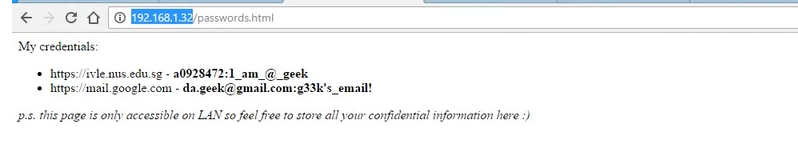
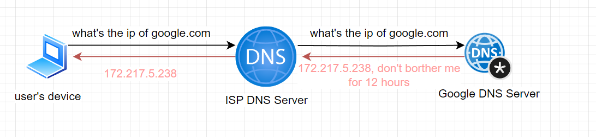
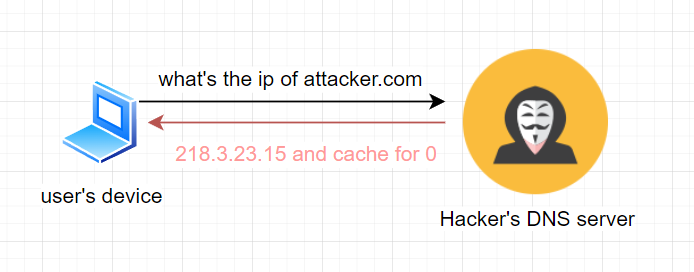
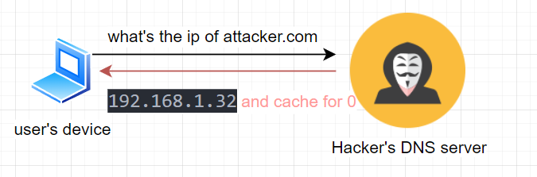

> DNS rebinding is a type of cyber attack where a malicious actor exploits vulnerabilities in DNS (Domain Name System) resolution to bypass the same-origin policy enforced by web browsers. 

To understand how DNS rebind works and how to mitigate the attacts, we need to know how DNS works, and what is same-origin policy.

### How DNS works？

1. The user inputs a domain name (e.g., example.com) into their web browser.
2. The web browser contacts the DNS resolver (typically provided by the ISP) to translate the domain name into an IP address.The DNS resolver checks its cache to see if it already has the IP address for the requested domain. If not, it sends a DNS query to the root DNS servers.
3. The root DNS servers direct the resolver to the appropriate Top-Level Domain (TLD) servers.
4. The TLD servers then direct the resolver to the Authoritative DNS servers responsible for the specific domain.
5. The Authoritative DNS servers provide the resolver with the IP address associated with the requested domain.
6. DNS Resolver now knows the IP address
7. The resolver returns the IP address to the user's web browser.
The web browser uses the IP address to establish a connection with the web server hosting the desired website.The web server sends the requested web page back to the user's web browser.

This process allows users to access websites using human-readable domain names while the underlying internet infrastructure relies on IP addresses to route traffic.

 
 
 
 
 
 

### The same origin policy

It's a browser's job to not allow http request to the endpoin which has different domain/portocal/sub-domain/port with the host website. To prevent mamalicious API call by using existing stored cookies whichi normally include user's login token.

### The DNS refine attack

In a DNS rebinding attack, the attacker typically sets up a malicious website and lures victims into visiting it. Initially, the website might appear harmless and serve benign content. However, the attacker's DNS server responds to DNS queries for the malicious domain with a short time-to-live (TTL) value.

After the victim's browser resolves the domain to an IP address and establishes a connection with the attacker's server, the attacker changes the DNS mapping to point to a different IP address, one that might be on the victim's local network, such as their router or IoT devices. Since the browser's same-origin policy considers the new IP address as part of the same origin, the attacker can now send requests to resources on the victim's network, potentially exploiting vulnerabilities in routers or IoT devices.

### Explain in examples

Let's say we have a server runs in internal network at IP address 192.168.1.32 and which has some sensitive information.

In the normal case, the DNS server will cache for the IP address, which means the TTL (time to live) is long for the result. In this case, it cache ip of google.com for 12 hours. 

But in the DNS rebind case, the user is requesting a DNS server which is controlled by the hacker, and with 0 TTL for the response.

And, the hacker can immediately change the response to your internal ip address next time you explore the website.

now, the hacker already bypassed the same origin check. Your browser is now a proxy for the hacker to hack your personal information, or event hack the company network.

## How to mitigate DNS rebinding attacks

1. Don't allow DNS resolver to response internal IP address like `0.0.0.0` `127.0.**` `192.168.**` .
2. Validate the `Host` header in the http request.
3. Install anti malicious tools to protect your computer.